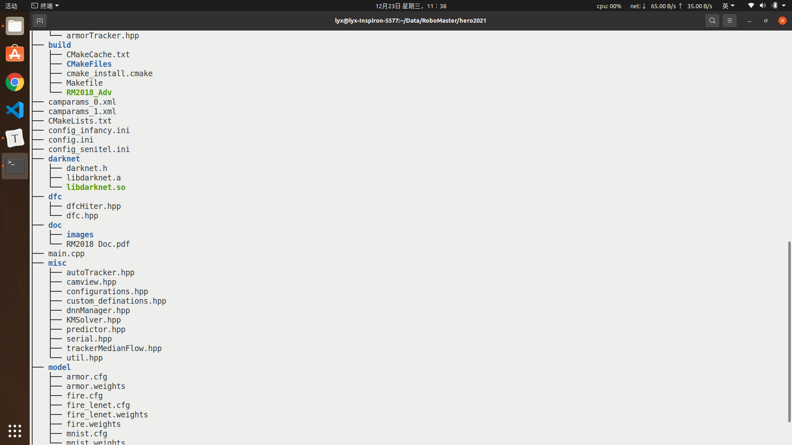

# Hero2021

这一版程序包含了决赛阶段算法的完整框架，对于神符模块和自动引导模块只需要编写对应的class文件即可，调试代码可以写在main文件尾部的两个函数中;运行程序前修改configuration中的mainEntry使程序跳转到对应功能模块就可以调试运行了。
对于dsfHiter.hpp 和 autoleader.hpp 的修改有：
   继承 ModuleBase 时，使用 public 继承
   初始化ModuleBase时，autoleader修改了ModuleID
   Update函数修改了参数，帧信息数据结构ImageData包含了该帧图像以及该帧图像对应的电控信息，使用电控信息时应该从这里获取

调试时，注意选择对应你摄像头的分辨率，通过Configuration可以修改，而且需要先标定摄像头，修改程序入口为10可以进入标定程序，缺少标定文件可能会报错。摄像头标定如果不用标定板也可以在网上百度棋盘格的图片，自行数出格点的个数，量出边长，也可以完成标定。

使用宏SET_CONFIG_VARIABLE系列，可以快速指定通过config动态更新的变量，需要注意通过此方法设置需要保证config中变量名与设定的变量名完全一致
编译程序前，请修改custom_definations文件 修改路径和设备类型，使用jetson TX1/2选择DEVICE_TX，其他基本都可以选DEVICE_MANIFOLD，目前这个选择只会影响摄像头设备，这是因为TX有一个自带的摄像头

框架实现的一些功能模块（CameraView,ConfigurationVariables,SerialManager,...）的使用可以参照装甲相关程序

这一版程序串口还是秒算的串口 TX版本串口暂时不能使用...
Good luck!

# 修改日志
## 2020.12.22

修改darknet依赖，不再需要本地编译darknet，将darknet所需文件都保存到darknet文件夹

## 2020.12.23

修改文件目录，原始代码所有文件都放在一个目录下，看起来十分杂乱，所以将原始代码重新划分,目录如下:

- misc：保存一些使用到的工具，应该在最先include进来，因为后面的文件会使用到这些库文件
- armor:装甲板检测相关文件
- build:编译中间文件保存文件夹
- dfc:大风车识别相关文件
- doc:学长编写的参考文档以及md文件图片保存地址
- model:数字识别模型
- main.cpp:主函数
- camparams_*.xml：摄像头标定参数文件
- config*.ini：不同机器人的配置文件

## 2020.12.25

1.修改串口设备号:

\#ifdef DEVICE_TX 

​        const char* Dev[4] = {"/dev/ttyTHS1","/dev/ttyTHS2", "/dev/ttyTHS3",""};

\#elif defined DEVICE_MANIFOLD

​        const char* Dev[4] = {"/dev/ttyS0","/dev/ttyTHS2","",""};

\#elif defined DEVICE_PC

​        const char* Dev[4] = {"/dev/ttyUSB0","/dev/ttyUSB1","",""};

\#endif

如上所示：在秒算，TX之后还添加了PC,用于在个人电脑调试，mainfold自带串口为ttyS0和ttyTHS2，tx2应该都有，PC只能使用USB串口

2.注意由于mainfold和 tx2是arm架构的处理器，而PC是x86架构的处理器，如果编译的时候报错找不到-dardknet，请根据自身cpu架构重新编译darknet然后将编译后的libdarknet.a,libdarknet.so拷贝到darknet文件夹替换原文件。

## 2021.1.1

1.重构dnnmanager，将多余部分删除，只留下了装甲板检测部分的代码

2.移除darknet依赖，使用opencv自带的readNetFromDarknet读取darknet模型，参考dnnManager.hpp

## 2021.1.4

1.capture_init()函数依赖于opencv对libv4l2的支持，所以编译opencv的时候必须要选择with_v4l2，但是不要选择with_libv4l2

## 2021.1.5

1.删除自动阻挡，大神符打击模块，添加dfc打击模块，但是还未定义，具体定义参见armor类实现
2.添加dfcDetector.hpp ，增加dfc装甲板检测，目前只有装甲板检测
3.增加测试视频，放在doc/videos里面

## 2021.1.8

1.由于现在服务器全面采用公网访问，公网流量有限制，所以暂时将视频移除，如果需要测试请在下面的链接下载。放在doc/videos/文件夹下。

链接: https://pan.baidu.com/s/1aZDU3FR5Jb--TCtOlrK4eg  密码: mlcp

2.重新标定了相机

## 2021.1.9

1.调节了云台pitch和yaw 的pid

2.增加了发送线程，用于调试

3.修改文件：main.cpp armor_detector

## 2021.1.12

1.删除了git中video缓存，减少了仓库体积

2.根据不同机器人配置了不同config文件，保存于config文件夹下

## 2021.1.13

1.调试测距离很不稳定，测试发现黄老板代码里面关于距离测量采用的是“近大远小”的思想，所以需要调节参数，并且算出的结果很不稳定，所以打算采用pnp算法求解距离。

2.添加修改一些冗余代码

## 2021.1.14

1.添加pnp解算，但是单目相机测距确实不稳定，还是“近大远小测距”调试一下吧。